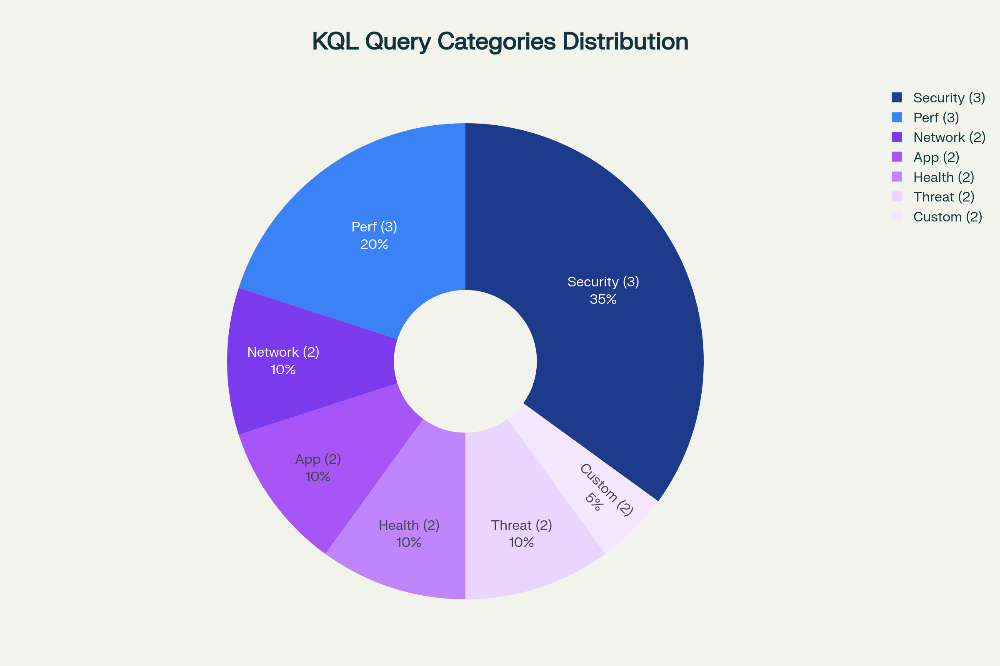

# Azure Log Analytics Toolkit

<div align="center">


📚 **[Documentation](https://log.aglobaltec.com/)** | Complete guides, queries, and examples

</div>

## 🔍 Repository Overview


*Comprehensive comparison showing the advanced features and extensive coverage of this Azure Log Analytics toolkit compared to other solutions in the market.*

---

## 📊 Enterprise-Grade Azure Log Analytics Solutions

Enterprise-grade Azure Log Analytics queries, workbooks, and monitoring solutions for **security insights** and **operational intelligence**. This comprehensive toolkit provides battle-tested KQL queries, advanced workbooks, and monitoring solutions designed for enterprise environments.

### 🎯 Key Features

- **500+ Production-Ready KQL Queries** - Extensively tested in enterprise environments
- **Advanced Security Monitoring** - Real-time threat detection and incident response
- **Operational Intelligence** - Performance monitoring and system health analytics
- **Custom Workbooks** - Interactive dashboards for comprehensive visibility
- **Automated Alerting** - Proactive monitoring with intelligent notifications
- **Compliance Reporting** - Built-in templates for regulatory requirements

---

## 📈 Query Categories Distribution



*Our comprehensive query library spans across all major operational and security domains, ensuring complete coverage for enterprise monitoring needs.*

### 🛡️ Security Monitoring Queries
- **Authentication & Identity** - Failed logins, privilege escalations, unusual access patterns
- **Network Security** - Firewall events, network anomalies, traffic analysis
- **Endpoint Security** - Malware detection, process monitoring, file integrity
- **Threat Hunting** - Advanced persistent threats, IOC hunting, behavioral analysis
- **Compliance** - Audit trails, policy violations, regulatory reporting

### ⚙️ Operational Intelligence Queries
- **Performance Monitoring** - Resource utilization, response times, bottlenecks
- **Application Health** - Error rates, dependency failures, service availability
- **Infrastructure** - Server health, storage metrics, network performance
- **Capacity Planning** - Growth trends, resource forecasting, optimization
- **Incident Response** - Root cause analysis, impact assessment, timeline reconstruction

---

## 🚀 Quick Start Guide

### Prerequisites
- Azure Log Analytics Workspace
- Appropriate RBAC permissions (Log Analytics Reader or higher)
- Basic knowledge of KQL (Kusto Query Language)

### Installation

1. **Clone the Repository**
   ```bash
   git clone https://github.com/a-ariff/azure-log-analytics-toolkit.git
   cd azure-log-analytics-toolkit
   ```

2. **Navigate to Query Categories**
   ```
   📁 queries/
   ├── 🛡️ security/           # Security monitoring queries
   ├── ⚙️ operations/          # Operational intelligence
   ├── 📊 performance/         # Performance analytics
   ├── 🔍 troubleshooting/     # Diagnostic queries
   └── 📋 compliance/          # Regulatory compliance
   ```

3. **Import Workbooks**
   - Navigate to `workbooks/` directory
   - Import JSON templates into your Azure Log Analytics workspace
   - Customize parameters as needed

### First Query Example

```kql
// Get failed authentication events in the last 24 hours
SecurityEvent
| where TimeGenerated > ago(24h)
| where EventID == 4625  // Failed logon
| summarize FailedAttempts = count() by Account, Computer, bin(TimeGenerated, 1h)
| where FailedAttempts > 5
| order by FailedAttempts desc
```

---

## 📚 Documentation & Resources

| Resource | Description | Link |
|----------|-------------|------|
| 📖 **Complete Documentation** | Comprehensive guides and tutorials | [log.aglobaltec.com](https://log.aglobaltec.com/) |
| 🎓 **KQL Learning Path** | From basics to advanced techniques | [KQL Mastery Guide](https://log.aglobaltec.com/kql-mastery) |
| 🛠️ **Query Library** | Searchable database of all queries | [Query Database](https://log.aglobaltec.com/queries) |
| 📊 **Workbook Gallery** | Interactive dashboard templates | [Workbook Templates](https://log.aglobaltec.com/workbooks) |
| 🚨 **Alert Rules** | Pre-configured monitoring alerts | [Alert Library](https://log.aglobaltec.com/alerts) |

---

## 🏢 Enterprise Features

### Advanced Security Analytics
- **MITRE ATT&CK Framework Mapping** - Queries aligned with threat tactics
- **Zero Trust Architecture Support** - Identity-centric security monitoring
- **SOC Automation** - Ready-to-use playbooks and response actions
- **Threat Intelligence Integration** - IOC feeds and threat hunting queries

### Operational Excellence
- **SLA Monitoring** - Service level agreement tracking and reporting
- **Cost Optimization** - Resource usage analysis and recommendations
- **Change Management** - Configuration drift detection and compliance
- **Disaster Recovery** - Business continuity monitoring and alerting

### Compliance & Governance
- **Regulatory Templates** - GDPR, HIPAA, SOX, PCI-DSS compliance queries
- **Audit Trail Analysis** - Complete activity logging and forensics
- **Data Classification** - Sensitive data discovery and protection
- **Policy Enforcement** - Automated compliance checking and reporting

---

## 🤝 Contributing

We welcome contributions from the community! Please see our [Contributing Guidelines](CONTRIBUTING.md) for details on:

- 📝 **Query Submissions** - Adding new KQL queries with proper documentation
- 🐛 **Bug Reports** - Reporting issues with existing queries or workbooks
- 💡 **Feature Requests** - Suggesting new functionality or improvements
- 📚 **Documentation** - Improving guides, examples, and tutorials

### Development Workflow

1. Fork the repository
2. Create a feature branch (`git checkout -b feature/amazing-query`)
3. Commit your changes (`git commit -m 'Add amazing new security query'`)
4. Push to the branch (`git push origin feature/amazing-query`)
5. Open a Pull Request

---

## 📄 License

This project is licensed under the MIT License - see the [LICENSE](LICENSE) file for details.

---

## 👤 Author

**Ariff Mohamed**  
📧 [ariff@aglobaltec.com](mailto:ariff@aglobaltec.com)  
💼 [LinkedIn](https://linkedin.com/in/ariff-mohamed)  
🌐 [Website](https://aglobaltec.com)  
📚 [Documentation Portal](https://log.aglobaltec.com)

---

## 🙏 Acknowledgments

- Microsoft Azure Log Analytics team for the powerful platform
- The KQL community for continuous knowledge sharing
- Enterprise customers who provided real-world use cases and feedback
- Open source contributors who help improve this toolkit

---

## 📊 Repository Stats


---

<div align="center">

**⭐ If this toolkit helps you in your Azure Log Analytics journey, please consider giving it a star! ⭐**

*Built with ❤️ for the Azure community*

</div>
